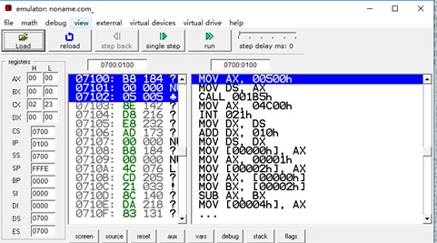
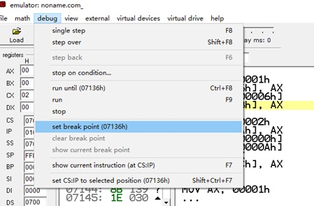
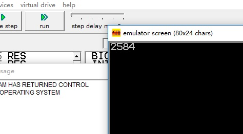

# 一个简单的C语言编译器
该项目是我们大三时候编译原理的大作业，最近临近毕业，整理电脑文件的时候又翻出来，决定放到GitHub上，也算是对学习了四年计算机的大学生活的一个见证吧。

该编译器几乎支持C语言除了指针，内存申请外的所有语法，可支持函数的递归调用，并且内置了输入输出函数。

## 0、使用环境
- 较新版本的C++编译器
- bison&flex （本代码仓库中已经包含Windows版）
- emu8086 （一个小型的x86模拟器，仓库中已经包含Windows版安装包）

## 1、文件说明

文件名 | 说明
------------ | -------------
emu8086v408r11.zip	| x86模拟器，可运行汇编代码
compiler.vsdx	| C语言语法结构图
src-文件夹下 |	---------------------------
custom_build_rules-文件夹	|	bison和flex的配置文件
data-文件夹	|	bison和flex的数据文件
my_compiler.l	|	flex 词法分析文件
lex.yy.c	|	根据词法flex词法规则自动生成的文件
my_compiler.y	|	bison语法分析文件
my_compiler.tab.c	|	bison自动生成的c语言源代码
my_compiler.tab.h	|	bison自动生成的头文件
AST.cpp	|	生成语法树的主要函数
AST.h	|	语法树的头文件，其他结构体定义
Praser.cpp	|	解析语法树主程序
Praser.h	|	解析语法树的头文件（定义类）
AsmCode.cpp	|	生成汇编语言的主要函数
AsmCode.h	|	生成汇编语言的主要头文件（定义类）
-------------------- |	--------------------
test.c	|	被编译的例子程序
com.bat	|	批处理文件，用于编译
win_bison.exe	|	bison程序
win_flex.exe	|	flex 程序
FlexLexer.h	|	flex/bison自带，与在flex中使用C++有关

## 2、使用方法
### 2.1 编译
方法1：cd到src文件夹，在cmd或者powershell 中运行com.bat 批处理脚本（需要g++）
方法2：在src文件夹下依次执行如下命令：
```
.\win_flex.exe .\my_compiler.l
.\win_bison.exe .\my_compiler.y -d
g++ -std=c++11 -o compiler AST.cpp my_compiler.tab.c lex.yy.c Praser.cpp AsmCode.cpp
```
### 2.2 运行
有两种方式可以运行，一种是在程序后加入要编译的文件名，如


另一种是直接不加参数运行，类似于些C语言脚本文件，在power shell中输入参数，键入^z(ctrl + z)表示EOF，程序读取输入结束，开始解析。如：


 
### 2.3 运行汇编代码
需要先安装emu8080 ，Windows平台下的安装包已经提供，为emu8086v408r11.zip

打开后，进入主界面，点击 new

 

再选择 com，当然其他也可以，点击ok，出现编辑窗口

再复制前一步shell中从inner_code_end到objcoed_gen_end之间的代码（或者可以使用 >重定向符 将输出流重定向到文件后直接从文件中复制）

---------------------inner_code_end---------------------------

//要复制的代码

--------------------objcoed_gen_end---------------------------

 

换到emu8086的代码编辑界面，CTRL + A 全选，然后CTRL + V复制
点击emulate 按钮，显示正在assember ，等待一小段时间

 

这时弹出两个窗口，第一个可以查看寄存器，内存信息，点击run表示开始执行，点击single step 表示一次只执行一条代码。

 

第二个窗口可以更加方便的显示代码的执行状况

 

如要设置断点，点击一条代码后，选择

 

运行过程中可能需要输入，请确保输入法为**英文输入模式**，输入结束后按Enter键。

## 3、其他说明
具体支持什么样的语法功能请看 实现原理.doc

**！！注意**    
输入一个数的写法为 a=scan();    
输出一个数的写法为 print(a);    
其他写法和C语言相同。

- 写函数时，非main函数一定要有return语句（会影响汇编代码的正确性，与中间代码无关）
- 写函数时，调用的参数不要超过四个。（同样只影响汇编代码）
- 在编译器出错时，不要急着否定编译器，先看看自己的源代码是否规范，我对编译器还是比较自信的，如果还有错误，可以联系我一同探讨。

由于在生成中间代码时对逻辑表达式语句和条件判断语句考虑的比较复杂，  
如int a=(1>0) +1;// 得a=2   
和 if (10){…}  //进入if     
等情况，以一种比较通用的方式生成中间代码，情况比较复杂，所以在生产汇编代码的时候有一个隐藏的bug，这个bug可能导致汇编代码的条件判断语句出错（在短路求值，&&或者||符号两边的判断符号不相等的时候），所以如果要运行汇编代码，尽量不要使用复杂的短路求值逻辑表达式（但此时仍可以生成正确的中间语言代码）。

除此之外，由于8086模拟器的内存有限，所以递归调用不要太深。


以下面求斐波那契数列的第n项来说，运行到**第18项2584** 没有问题，此时的剩余内存还有很多（剩余80%），不过我再没有继续试，因为模拟器运行代码的速度实在太慢了。

```c
int fib(int n)
{
    int ans;
    if(n==1){
        ans=1;
    }else if(n==2){
        ans=1;
    }
    else{
        ans=fib(n-1)+fib(n-2);
    }
    return ans;
    
}
int main()
{
    int a,v;
    a=scan();  //从键盘中读入一个数
    v=fib(a);
    print(v);
    return 0;
}
```



## 4、迭代版本记录


## 5、致谢
- 一个分析C语言语法的网站给了我很大的帮助，主页为 http://www.quut.com/c/ANSI-C-grammar-y-1995.html
- 通过阅读Uyouii所写的[cCompiler](https://github.com/Uyouii/cCompiler)，在项目前期我了解了大致框架并且获得了许多灵感